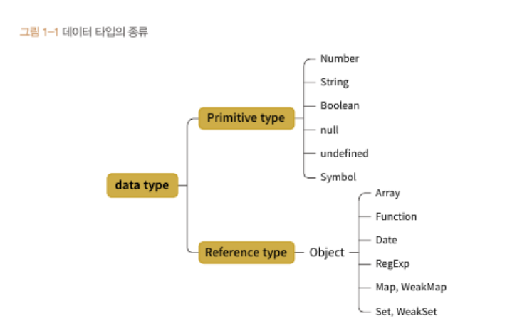

# 코어자바스크립트 1장

### 요약

기본형(Primitive type) immutable → 값이 담긴 주솟값을 바로 복제

참조형(Reference type) mutable → 값이 담긴 주솟값들로 이루어진 묶음을 가리키는 주솟값을 복제



심볼, Map, WeakMap, Set, WeakSet

[JavaScript Map 데이터 구조 사용법 한 번에 정리하기 : 생성, set, get, has, delete, clear](https://kotlinworld.com/414)

[[자바스크립트] 심볼 (Symbol) 타입](https://velog.io/@leeyw2709/자바스크립트-심볼-Symbol-타입)

[위크맵과 위크셋](https://ko.javascript.info/weakmap-weakset)

[ES6의 심볼, 이터레이터, 제네레이터에 대해 알아보자](https://gist.github.com/qodot/ecf8d90ce291196817f8cf6117036997)


```jsx
let visitsCountMap = new Map();
```


```jsx
let visitsCountMap = new WeakMap();
```

```jsx
let visitsCountMap = new Map(); // 맵에 사용자의 방문 횟수를 저장함
// let visitsCountMap = new WeakMap(); // 맵에 사용자의 방문 횟수를 저장함
// 사용자가 방문하면 방문 횟수를 늘려줍니다.
function countUser(user) {
  let count = visitsCountMap.get(user) || 0;
  visitsCountMap.set(user, count + 1);
}

let john = { name: "John" };

countUser(john); // John의 방문 횟수를 증가시킵니다.
countUser(john); // John의 방문 횟수를 증가시킵니다.
console.log("visitsCountMap", visitsCountMap.get(john)); // 2
// John의 방문 횟수를 셀 필요가 없어지면 아래와 같이 john을 null로 덮어씁니다.
john = null;
```

**참조 카운트가 0인 메모리 주소는 가비지 컬렉터의 수거 대상이 된다**

**WeakMap과 WeakSet**

키로 사용된 객체가 다른 곳에서 참조되지 않으면, 가비지 컬렉터가 이를 수거할 수 있습니다.

자바스크립트 엔진으로 바라본 선언과정 vs 할당과정

```jsx
var a; // 변수 a 선언
a = "abc"; // 변수 a에 데이터 할당

var a = "abc"; // 위에 두줄을 한줄로 표현했을뿐 JS엔진에서는 동일한 일을 한다
```

1. **선언과정 → 메모리에 비어있는 공간을 확보하고 그 공간의 이름을 설정**
2. **할당과정 → a라는 이름을 가진 주소를 검색해서 (변수영역)그곳에 데이터 영역에 저장된 ‘abc’의 주소값을 할당**

```
**TDZ 구간**에 있는 변수 객체는선언은 되어있지만 아직 초기화가 되지 않아 변수에 담길 값을 위한 공간이 메모리에 할당되지 않은 상태라고 할 수 있습니다. 이때 해당 변수에 접근을 시도하면 얄짤없이 Cannot access '%' before initialization 에러 메시지를 만나게 되는 것입니다.
```

**변수영역, 데이터 영역 분리 → 중복된 데이터에 대한 처리 효율이 높아진다**

**불변값 vs 상수**

변수와 상수를 구분 짓는 변경 가능성의 대상은 **변수 영역 메모리**

불변성 여부를 구현할 때의 변경 가능성의 대상은 **데이터 영역 메모리**

**“setState, memo 모두 데이터 메모리의 변조 여부가 중요 판단 기준”**
