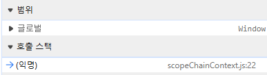

# 실행 컨텍스트

**실행 컨텍스트란?**

실행할 코드에 제공할 환경 정보들을 모아 놓은 객체!

**자바스크립트가 실행이 될 때 필요한 3가지**

1. Variable Object
2. Scope Chain
3. this 값

**실행 컨텍스트 종류**

1. Global execution context (GEC)
무조건 하나만 존재 (왜나면 자바스크립트는 싱글스레드로 동작하기 때문에)
2. Functional execution context (FEC)
함수마다 스코프를 가지는데 실행되고 있는 함수에 대한 실행 컨텍스트 
3. Eval
극히 드문 케이스 → 동적 스코프 eval이 호출된 컨텍스트의 변수에 접근
    - eval의 사용은 일반적으로 권장되지 않습니다.
    - 보안 취약점, 성능 저하, 디버깅의 어려움 등의 문제가 있습니다.
    - 대부분의 경우 eval 대신 다른 방법을 사용하는 것이 좋습니다.

**(참고) 
렉시컬 스코프**는 한 마디로 **함수를 어디에 선언하였는지에 따라 상위 스코프가 결정**되는 것을 말한다. 
**자바스크립트를 포함한 대부분의 프로그래밍 언어는 렉시컬 스코프를 따르며,** 이를 정적 스코프(Static Scope) 라고 부르기도 한다.

**실행 컨텍스트(Execution Context) 구성 요소**

1. LexicalEnvironment (두 가지 정보를 수집)
    1. Environment Record
    - 현재 스코프에 대한 모든 식별자 정보를 기록하는 객체
    - 변수, 함수 선언, 매개변수 등의 바인딩을 저장
    2. Outer Reference
    - 외부 렉시컬 환경에 대한 참조를 포함
    - 스코프 체인을 구현하는 데 사용
2. VariableEnvironment
var로 선언된 변수와 함수 선언을 저장
3. ThisBinding
현재 실행 컨텍스트에서 this 키워드가 참조하는 값을 결정

VariableEnvironment와 LexicalEnvironment의 분리는 이처럼 다른 스코프 규칙을 가진 변수들을 효과적으로 관리하고, 이전 버전과의 호환성을 유지하면서도 새로운 기능을 제공할 수 있게 해줍니다.

- 호이스팅
- 블록 스코프(let, const) vs 함수 스코프(var)

**VariableEnvironment에 담기는 내용은 LexicalEnvironment와 같지만 최초 실행 시의 스냅샷이 유지**

```jsx
function example() {
    var a = 1;
    let b = 2;

    if (true) {
        var c = 3;
        let d = 4;
    }

    console.log(a, b, c, d);
}

example();
```

1. 초기 상태:
    - VariableEnvironment와 LexicalEnvironment 모두 `a`와 `c`를 포함합니다 (var로 선언되었으므로).
2. 실행 중:
    - LexicalEnvironment는 `b`를 추가로 포함하게 됩니다.
    - if 블록 내부에서 LexicalEnvironment는 `d`도 포함하지만, 블록을 벗어나면 `d`는 제거됩니다.
3. 최종 상태:
    - VariableEnvironment는 여전히 초기 상태(`a`와 `c`만 포함)를 유지합니다.
    - LexicalEnvironment는 `a`, `b`, `c`를 포함합니다 (`d`는 블록 스코프를 벗어나 사라짐).
    

이러한 메커니즘은 JavaScript의 호이스팅, 스코프, 클로저 등의 동작을 구현하는 데 중요한 역할을 합니다. VariableEnvironment가 초기 상태를 유지함으로써, var의 호이스팅 동작을 일관되게 유지할 수 있으며, LexicalEnvironment의 동적 변화를 통해 블록 스코프와 같은 새로운 기능을 지원할 수 있습니다.

**Environment Record && Outer Reference**

```jsx
let x = 10;

function outer() {
    let y = 20;
    function inner() {
        let z = 30;
        console.log(x + y + z);
    }
    inner();
}

outer();
```

- 전역 LexicalEnvironment의 Environment Record는 `x`와 `outer`를 포함합니다.
- `outer` 함수의 LexicalEnvironment의 Environment Record는 `y`와 `inner`를 포함하고, 
외부 참조로 전역 LexicalEnvironment의 Environment Record 를 가리킵니다.
- `inner` 함수의 LexicalEnvironment의 Environment Record는 `z`를 포함하고, 
외부 참조로 `outer`의 LexicalEnvironment의 Environment Record를 가리킵니다.

[Execution context, Scope chain and JavaScript internals](https://medium.com/@happymishra66/execution-context-in-javascript-319dd72e8e2c)

**JavaScript engine creates the execution context in the following two stages**

1. Creation phase (선언)
    1. **Creates the Activation object or the Variable object
    Activation object :** Global execution context에 해당하면 Variable object
    **Variable object :** Functional execution context에 해당하는 변수 객체
    2. **Creates the scope chain
    변수가 유효한 영역 (최상위는 global / window)**
    3. **Determines the value of this**
2. Execution phase (할당)

Creation phase / Execution phase 와 VariableEnvironment / LexicalEnvironment의 관계

- 두 환경 모두 Creation Phase에서 생성됩니다.
- VariableEnvironment는 생성 이후 변경되지 않습니다.
- LexicalEnvironment는 Execution Phase 동안 변경될 수 있습니다.

```jsx
a = 1;

var b = 2;

cFunc = function (e) {
  var c = 10;
  var d = 15;

  console.log(c);
  console.log(a);

  function dFunc() {
    var f = 5;
    console.log(f);
    console.log(c);
    console.log(a);
  }

  dFunc();
};

cFunc(10);
```

1. 상황: cFunc(10) 진입 직전 
결과: 글로벌에는 a=1, b=2 저장됨



```jsx
globalExecutionContextObj = {
  activationbj: {
      argumentObj : {
          length:0
      },
      b: undefined,
      cFunc: Pointer to the function definition // 함수 메모리의 주소를 힙메모리 어딘가 저장
  },
  scopeChain: [GLobal execution context variable object],
  this: value of this
}
```

Creation phase 

```jsx
globalExecutionContextObj = {
  activationbj: {
      argumentObj : {
          length:0
      },
      b: 2,
      cFunc: Pointer to the function definition, // 함수 메모리의 주소를 힙메모리 어딘가 저장
      a: 1
  },
  scopeChain: [GLobal execution context variable object],
  this: value of this
}
```

Execution phase 

1. 상황: cFunc(10) 호출! && dFunc() 진입 직전
결과: 콜스택 → 실행컨텍스트가 콜스택이라는 곳에 쌓인다


```jsx
cFuncExecutionContextObj = {
  activationbj: {
      argumentObj : {
          0: e,
          length:1
      },
      e: 10,
      c: undefined,
      d: undefined
      dFunc: Pointer to the function definition,
  },
  scopeChain: [cFunc variable object, Global exection context variable object],
  this: value of this
}
```

Creation phase 

```jsx
cFuncExecutionContextObj = {
  activationbj: {
      argumentObj : {
          0: e,
          length:1
      },
      e: 10,
      c: 10,
      d: 15
      dFunc: Pointer to the function definition,
  },
  scopeChain: [cFunc variable object, Global exection context variable object],
  this: value of this
}
```

Execution phase 

1. 상황: dFunc() 호출!
결과: 글로벌에는 a=1, b=2 저장됨


```jsx
dFuncExecutionContextObj = {
  activationbj: {
      argumentObj : {
          length:0
      },
      f: undefined,
  },
  scopeChain: [dFunc variable object, 
               cFunc variable object,
               Global execution context variable object],
  this: value of this
}
```

Creation phase 

```jsx
dFuncExecutionContextObj = {
  activationbj: {
      argumentObj : {
          length:0
      },
      f: 5,
  },
  scopeChain: [dFunc variable object, 
               cFunc variable object,
               Global execution context variable object],
  this: value of this
}
```

Execution phase 

```jsx
n0 = "n0";
var v0 = "v0";
let l0 = "l0";
const c0 = "c0";
console.log(v0, n0, l0, c0); // v0 n0 l0 c0
console.log(window.v0, window.n0, window.l0, window.c0); // v0 n0 undefined undefined
function fn2() {
  n2 = "n2";
  console.log(n0, n1, n2); // n0 n1 n2
  var v2 = "v2";
  console.log(v0, v2); // v0 v2
  // console.log(v1)
  let l2 = "l2";
  console.log(l0, l2); // l0 l2
  // console.log(l1);
  const c2 = "c2;";
  console.log(c0, c2); // c0 c2
  // console.log(c1);
}
function fn1() {
  n1 = "n1";
  var v1 = "v1";
  let l1 = "l1";
  const c1 = "c1";
  fn2();
}
fn1();
console.log(n2); // n2
// console.log(v2, l2, c2);

```


```jsx
n0 = "n0";
var v0 = "v0";
let l0 = "l0";
const c0 = "c0";
console.log(v0, n0, l0, c0); // v0 n0 l0 c0
console.log(window.v0, window.n0, window.l0, window.c0); // v0 n0 undefined undefined

function fn1() {
  n1 = "n1";
  var v1 = "v1";
  let l1 = "l1";
  const c1 = "c1";
  function fn2() {
    n2 = "n2";
    console.log(n0, n1, n2); // n0 n1 n2
    var v2 = "v2";
    console.log(v0, v2); // v0 v2
    console.log(v1); // v1
    let l2 = "l2";
    console.log(l0, l2); // l0 l2
    console.log(l1); // l1
    const c2 = "c2;";
    console.log(c0, c2); // c0 c2
    console.log(c1); // c1
  }
  fn2();
}
fn1();

```


• ES6에서 도입된 let과 const는 전역 객체를 오염시키지 않도록 설계되었습니다.
• 이들은 전역 렉시컬 환경의 선언적 환경 레코드에 저장되며, 이는 개발자 도구에서 스크립트 영역으로 표시됩니다.

이러한 동작은 변수의 스코프와 접근성을 더 명확하게 관리하고, 전역 네임스페이스의 오염을 줄이는 데 도움을 줍니다. let과 const를 사용함으로써 더 예측 가능하고 안전한 코드를 작성할 수 있습니다.

 **ReferenceError: b is not defined**

```jsx
const x = "x";
function c() {
  const y = "y";
  console.log("c");
  function b() {
    const z = "z";
    console.log("b");
    c();
  }
}

function a() {
  const x = "x";
  console.log("a");
  b(); // ReferenceError: b is not defined
}

a();
```

**호출 스택**은 함수가 호출 될때 쌓이고 실행이 끝나면 빠져나간다

**스코프**는 **변수나 함수가 유효할 수 있는 범위**

**스코프체인은** **함수의 선언부를 기준**으로 결정됩니다. 이것을 '렉시컬 스코프(Lexical Scope)' 또는 '정적 스코프(Static Scope)'라고 부릅니다한 마디로 **함수를 어디에 선언하였는지에 따라 상위 스코프가 결정**

- c → anonymous
- a → anonymous
- b → c → anonymous

anonymous 기준에서는 a와 c에만 접근 가능하다