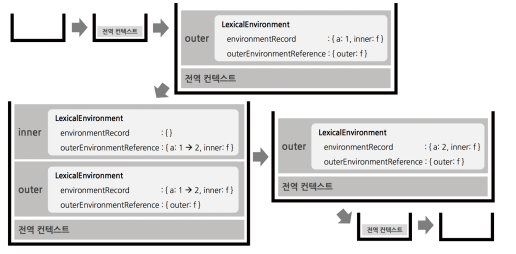

# 클로저

> 클로저는 ‘둘러싸여진 상태의 참조’와 함께 다발로 묶여진 함수의 콤비네이션이다
→ 클로저는 **내부 함수로부터 외부함수에의 접근권한을 준다
→** 클로저는 **함수 생성 시점**에 생긴다 
(호출하는 위치와는 상관없이 선언한 위치와 상관 있다 - 렉시컬 스코프)
> 

```
  var outer = function () {
    var a = 1;
    var inner = function () {
      console.log(++a);
    }; // inner 생성시 inner 함수와 outer 함수 사이의 OuterEnvironmentReference에 생성
    inner();
  }; // outer 함수 생성시 outer 함수와 전역 사이의 OuterEnvironmentReference 생성
  outer();

```



```
var outer = function() {
  var a = 1;
  var inner = function() {
    return ++a;
  };
  return inner;
};
var outer2 = outer();
console.log(outer2()); // 2
console.log(outer2()); // 3
outer2 = null; 
```


inner함수 environmentRecord 안에는 a가 없기 때문에 
inner함수의 [[Env]] : outer 를  참조한다

(outer는 실행컨텍스트상 죽은건데 자신의 environmentRecord 중에서 
inner함수가 OuterEnvironmentReference로 참조하고 있는 변수가 있기 때문에 살았다.)

어떤 함수의 lexicalEnvironment가 이를 참조할 예정인 다른 실행 컨텍스트가 있는 한 
실행 종료 이후에도 GC되지 않는다

inner함수의 실행컨텍스트가 활성화 되면 outerEnvironmentReference가 outer 함수의 lexicalEnvironment를 필요로 할 것이므로 가비지 컬렉터의 수집대상에서 제외된다 
→ inner 함수가 이 변수에 접근할 수 있게 된다

> LexicalEnvironment는 
environmentRecord와 outerEnvironmentReference 두 가지 주요 컴포넌트로 구성되어 있다.
> 
- environmentRecord:
    - 앞서 설명한 대로, 현재 스코프 내의 식별자들에 대한 정보를 담고 있습니다.
- outerEnvironmentReference:
    - 외부 렉시컬 환경에 대한 참조입니다.
    - 이를 통해 스코프 체인이 형성됩니다.
    - 현재 환경에서 식별자를 찾지 못할 경우, 이 참조를 따라 외부 환경으로 검색을 계속합니다.

클로저 발생 시 콜스택 흐름을 보면
outer의 LexicalEnvironment의 environmentRecord와 outerEnvironmentReference의 값은 outer의 실행 컨텍스트가 종료 되었을 때 다 파괴되지만 inner함수가 a변수를 참조할 예정이기 때문에 가비지 컬렉터 대상에서 제외가 되어 environmentRecord의 수집정보 {a:1}는 참조할 수 있도록 살려둔다
outer2() 함수가 호출되어 inner 실행 컨텍스트가 생성 되었을 때 실행 컨텍스트의 environmentRecord에는 수집할 정보가 없기 때문에 outerEnvironmentReference에는 inner 함수가 선언된 위치의 외부LexicalEnvironment가 참조복사가 되는데
위에 outer의 LexicalEnvironment는 environmentRecord의 수집정보 {a:1}을 제외하고는 다 파괴되었으므로 {a:1}의 environmentRecord만 참조하고 있다
이제 스코프 체이닝에 따라 outer에서 선언한 변수 a에 접근해서 1만큼 증가시킨 후 2를 반환하고 inner 함수의 실행컨텍스트가 종료된다

외부 변수를 내부 함수가 참조하지 않을때는 클로저 발생x


외부 변수를 내부 함수가 참조할 때 클로저 발생


### 상태 은닉화, 지정한 함수를 통해서만 상태에 접근 가능하도록 구상 가능

```jsx
// 카운트 상태 변경 함수
const increase = (function () {
  // 카운트 상태 변수
  let num = 0;

  // 클로저
  return function () {
    // 카운트 상태를 1만큼 증가 시킨다.
    return ++num;
  };
}());

console.log(increase()); // 1
console.log(increase()); // 2
console.log(increase()); // 3
```

num 변수는 외부에 노출이 되어있지 않고 오로지 increase, decrease에 의해서만 제어 가능

```
const counter = (function () {
  // 카운트 상태 변수
  let num = 0;

  // 클로저인 메서드를 갖는 객체를 반환한다.
  // 객체 리터럴은 스코프를 만들지 않는다.
  // 따라서 아래 메서드들의 상위 스코프는 즉시 실행 함수의 렉시컬 환경이다.
  return {
    // num: 0, // 프로퍼티는 public하므로 은닉되지 않는다.
    increase() {
      return ++num;
    },
    decrease() {
      return num > 0 ? --num : 0;
    }
  };
}());

console.log(counter.increase()); // 1
console.log(counter.increase()); // 2

console.log(counter.decrease()); // 1
console.log(counter.decrease()); // 0
```