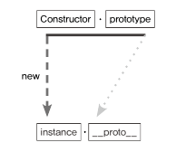

# 프로토타입




자바스크립트에서 모든 객체는 자신의 프로토타입(prototype)을 `__proto__`이라는 비밀 속성에 저장하고 있습니다.

Constructor의 prototype과 인스턴스 __proto __는 같은 객체를 가리킵니다

```jsx

var Constructor = function (name) {
  this.name = name;
};
Constructor.prototype.method1 = function () {};
Constructor.prototype.property1 = "Constructor Prototype Property";

var instance = new Constructor("Instance");
console.dir(Constructor);
console.dir(instance);
    
```


자바스크립트 함수에는 자동으로 객체인 prototype 프로퍼티를 생성해 놓는데, 해당 함수를 생성자 함수로서 사용할 경우, 즉 new 연산자와 함께 함수를 호출할 경우, 그로부터 생성된 인스턴스에는 숨겨진 프로퍼티인 __ proto __가 자동으로 생성되며, 이 프로퍼티는 생성자 함수의 prototype 프로퍼티를 참조한다.

**생성자 함수의 prototype에 어떤 메서드나 프로퍼티가 있다면 인스턴스에도 마치 자신의 것처럼 해당 메서드나 프로퍼티에 접근할 수 있게 된다**

```jsx
var arr = [1,2];
console.dir(arr);
console.dir(Array);
```


인스턴스의 __ proto __ 은 Array.prototype 을 참조하는데, 

__ proto __는 생략 가능하도록 설계되어 있기 때문에 인스턴스가 pop, push, forEach 등의 메서드를 마치 자신의 것처럼 호출할 수 있다.

Array의 prototype 프로퍼티 내부에 있지 않은 from, isArray 들의 메서드들은 인스턴스가 직접 호출할 수 없고, 이들은 Array 생성자 함수에서 직접 접근해야 실행이 가능하다.

**JavaScript에서 함수는 객체기 때문에 property를 가질 수 있다**

> constructor 프로퍼티
> 

생성자 함수의 프로피터인 prototype 객체 내부에는 constructor라는 프로피터가 있습니다
인스턴스 __proto __ 객체 내부에도 마찬가지 입니다.

원래의 생성자 함수를 참조 → 인스턴스로부터 그 원형이 무엇인지를 알 수 있는 수단


함수를 정의하면 해당하는 Person 함수 객체가 생성되면서 Person 함수의 prototype 객체가 하나 더 생긴다. (prototype, constructor를 통해서 서로 상호 참조를 한다)

- Person prototype proterty는 Person prototype 객체를 가리키고
- Person prototype 의 constructor proterty는 Person 객체를 가리킨다

```jsx
var Person = function (name) {
  this.name = name;
};
var p1 = new Person("사람1"); // Person { name: "사람1" } true
var p1Proto = Object.getPrototypeOf(p1); // p1 객체의 프로토타입 객체를 반환하는 메서드
var p2 = new Person.prototype.constructor("사람2"); // Person { name: "사람2" } true
var p3 = new p1Proto.constructor("사람3"); // Person { name: "사람3" } true
var p4 = new p1.__proto__.constructor("사람4"); // Person { name: "사람4" } true
var p5 = new p1.constructor("사람5"); // Person { name: "사람5" } true

[p1, p2, p3, p4, p5].forEach(function (p) {
  console.log(p, p instanceof Person);
});

Person { name: '사람1' } true
Person { name: '사람2' } true
Person { name: '사람3' } true
Person { name: '사람4' } true
Person { name: '사람5' } true
```

**프로토타입 설정**

1. 객체의 프로토타입은 일반적으로 객체를 생성할 때 **생성자 함수**에 의해 설정됩니다. 
생성자 함수의 `prototype` 속성이 가리키고 있는 객체를, 그 생성자 함수로 만든 객체의 `__proto__` 속성도 가리키게 된다

→ “new 연산자로 Constructor 를 호출하면 instance가 만들어지는데, 이 instance의 생략 가능한 프로퍼티인 __**proto** __는 Constructor의 prototype을 참조한다
→ 생성자 함수의 prototype에 어떤 메서드나 프로퍼티가 있다면 인스턴스에서도 마치 자신의 것처럼 해당 메서드나 프로퍼티에 접근할 수 있게 됩니다


1. `Object.create()` 메서드로 객체를 생성할 때 인자로 프로토타입을 넘기면 반환된 객체의 프로토타입으로 설정


1. 객체 리터럴에서는 **proto** 속성에 바로 해당 객테의 프로토타입 지정 가능


Object.getPrototypeOf(date) 를 활용하면 date.__proto__ 속성에 직접 접근하는 효과를 얻을 수 있다


```jsx
Object.getPrototypeOf(new Date()) === Date.prototype; // true
Object.getPrototypeOf(Object.create(Date.prototype)) === Date.prototype; // true
Object.getPrototypeOf({ __proto__: Date.prototype }) === Date.prototype; // true
```

date.__**proto__**.__**proto__ 속성에 접근하는 효과**


```jsx
Object.getPrototypeOf(Object.getPrototypeOf(new Date())) === Object.prototype;
```

`__proto__` 속성에 바로 접근하는 것은 웹 표준x

```jsx
class Person {
  constructor(name) {
    this.name = name;
  }

  getInfo() {
    return `Name: ${this.name}`;
  }
}

const date = new Date();
const proto = date.__proto__; // ❌
proto === Date.prototype; // true

const person = {};
person.__proto__ = Person.prototype; // ❌
person.name = "Dale";
person.getInfo(); // 'Name: Dale'

const date = new Date();
const proto = Object.getPrototypeOf(date); // ✅
proto === Date.prototype; // true

const person = {};
Object.setPrototypeOf(person, Person.prototype); // ✅
person.name = "Dale";
person.getInfo(); // 'Name: Dale'
```

**프로토타입 활용**

```jsx
[팩토리 패턴]

var 프로토타입 = {
  type: "카드",
  attack: function () {},
  defend: function () {},
};

function 카드공장(name, att, hp) {
  var 카드 = {
    name,
    att,
    hp,
  };
  //카드.__proto__ = 프로토타입;
  Object.setPrototypeOf(카드, 프로토타입); 
  return 카드;
}

var card1 = 카드공장("h1");
var card2 = 카드공장("h2");
var card3 = 카드공장("h3");
...
var card30000 = 카드공장("h30000");

console.log(card1.type); // 카드
console.log(card2.type);
console.log(card3.type);
...
console.log(card30000.type);

// card를 30000장 작업할 것을 프로토타입 한번에 다 바꿀 수 있다
프로토타입.type = "장난감";
console.log(card1.type); // 장난감
console.log(card2.type);
console.log(card3.type);
...
console.log(card30000.type);

프로토타입.width = 100;
프로토타입.height = 400;
console.log(card1.width, card1.height); // 100 400
console.log(card2.width, card2.height);
console.log(card3.width, card3.height);
...
console.log(card30000.width, card30000.height);

```

