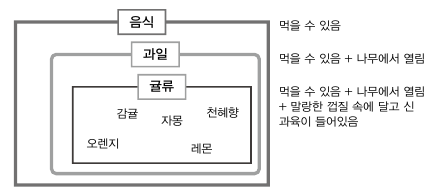

# 클래스



하위 개념(subclass)은 상위 개념(superclass)을 포함하면서 
더 구체적인 개념이 추가

- 스태틱 멤버(Static member)          → 인스턴스에서 참조 불가
- 인스턴스 멤버(Instance member) → 인스턴스에 상속되는지 (인스턴스가 참조 가능)


생성자 함수 Array를 new 연산자와 함께 호출하면 인스턴스가 생성.

- 이때 Array를 일종의 클래스라고 하면, Array의 prototype 객체 내부 요소들이 인스턴스에 ‘상속’된다고 볼 수 있음 
(엄밀히는 상속이 아닌 프로토타입 체이닝에 의한 참조)
- Array 내부 프로퍼티들 중 prototype 프로퍼티를 제외한 나머지는 인스턴스에 상속되지 않음

```jsx
var Rectangle = function (width, height) {
  this.width = width;
  this.height = height;
};
Rectangle.prototype.getArea = function () {
  return this.width * this.height;
};
Rectangle.isRectangle = function (instance) {
  return instance instanceof Rectangle && instance.width > 0 && instance.height > 0;
};

var rect1 = new Rectangle(3, 4);
// rect1 인스턴스에 width, height 프로퍼티에 각각 3,4의 값이 할당

// [프로토타입 메서드] 인스턴스에서 직접 호출할 수 있는 메서드
console.log(rect1.getArea()); // 12 (O) 
// rect1.(__proto__).getArea -> rect1.width * rect1.height

// [스태틱 메서드] 인스턴스에서 직접 접근할 수 없는 메서드
//console.log(rect1.isRectangle(rect1)); // Error (X) 
console.log(Rectangle.isRectangle(rect1)); // true
// 스태틱 메서드는 생성자 함수를 this로 해야만 호출할 수 있다

```


### 클래스 상속

```jsx
var Grade = function () {
  //유사배열객체 arguments를 실제 배열로 만드는 방법 3가지
  var args = Array.prototype.slice.call(arguments); // [1]
  //const args = [...arguments];  // [2] 스프레드 연산자 사용
  //const args = Array.from(arguments); // [3] Array.from
  for (var i = 0; i < args.length; i++) {
    this[i] = args[i];
  }
  //forEach, map, filter 같은 반복 메서드들이 length 속성을 사용
  this.length = args.length;
};

// Grade 객체가 배열의 모든 메서드를 상속받게 합니다
Grade.prototype = [];
var g = new Grade(100, 80);

console.log("g", g); // { '0': 100, '1': 80, length: 2 }
g.forEach((x) => console.log(x));
g.map((x) => console.log(x * 100));

```


```jsx
var Grade = function () {
  var args = Array.prototype.slice.call(arguments);
  for (var i = 0; i < args.length; i++) {
    this[i] = args[i];
  }
  this.length = args.length;
};
Grade.prototype = [];
var g = new Grade(100, 80);

g.push(90);
console.log(g); // Grade { 0: 100, 1: 80, 2: 90, length: 3 }

delete g.length;
g.push(70);
console.log(g); // { '0': 70, '1': 80, '2': 90, length: 1 }

g.push(700);
console.log(g); // { '0': 70, '1': 700, '2': 90, length: 2 }
g.forEach((x) => console.log(x));

70
700
```

g.push(70); 를 했을때 0번째 인덱스에 70이 들어가고 length가 다시 1이 될 수 있었던 이유

- push를 하기에 앞서서 g.length를 찾는다
- g.length가 없으면 g.__ proto__.length를 찾고,
- Grade.prototype이 빈 배열을 가리키고 있기 떄문에
- g.__ proto__.length → 빈 배열의 length 0 이 할당

```jsx
var Grade = function () {
  var args = Array.prototype.slice.call(arguments);
  for (var i = 0; i < args.length; i++) {
    this[i] = args[i];
  }
  this.length = args.length;
};
Grade.prototype = ["aa", "bb", "cc", "dd"];
var g = new Grade(100, 80);

g.push(90);
console.log(g); // Grade { 0: 100, 1: 80, 2: 90, length: 3 }
g.forEach((x) => console.log(x));

100
80
90

delete g.length;
g.push(70);
console.log(g); // Grade { 0: 100, 1: 80, 2: 90, ___ 4: 70, length: 5 }
g.forEach((x) => console.log(x));

100
80
90
dd
70
```

